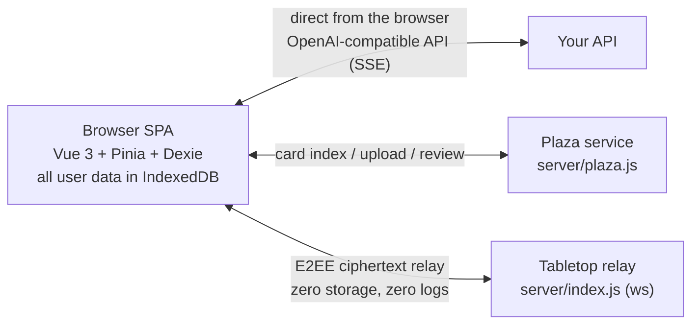

[中文](./README.md) | **English**

# RP · Xingyu (RP · 星屿)

[](https://github.com/dfzjb/rp-xingyu/actions/workflows/ci.yml)
[](./LICENSE)

A local-first AI roleplay web app: everything lives in your browser — zero user data on the server, no accounts, no telemetry. Compatible with the SillyTavern character-card ecosystem, with built-in memory systems, world books, regex scripts, an affinity engine, interactive UI templates and a card plaza. **Online tabletop is the primary space** (a sidebar slider switches between the TRPG and roleplay spaces), supporting both solo sessions and end-to-end encrypted multiplayer.

- **Local-first**: character cards, chat history and API keys all live in your browser's IndexedDB; back up any time with one click
- **Bring your own model**: the browser talks directly to any OpenAI-compatible API (official, proxied or local); main chat, memory aux model, image and video models are configured independently
- **Pure static**: the build output deploys to any static host under any sub-path — or just double-click `dist/index.html`


**Live demo**: [dfzjb.github.io/rp-xingyu](https://dfzjb.github.io/rp-xingyu/) (GitHub Pages — bring your own OpenAI-compatible API key)

## Features

### Online Tabletop (Primary Space)
- **Solo sessions**: play one-on-one with an AI KP/GM — no server required; a local in-memory relay stands in for WebSocket, and the story lives only in your browser
- **Multiplayer rooms** (optional): play with friends, expression dice (1d20, 2d6+3…) visible to everyone; invite links open straight into the room
- Rule systems: free-form / COC 7th / DND 5e / custom; quick or detailed room setup — KP style, era & tones, world, key NPCs, house rules, content red-lines, all drafted from a one-sentence idea
- **Story modules**: chapter outlines + planned routes + ending tables + fate-wheel random tables (AI-forged at room creation, or imported as JSON); the KP advances by chapter and reports `<module>` progress — everyone watches chapters/routes/endings live in the sidebar
- **Split storylines & game state**: personal and co-op lines each narrate their own (whoever opens a line pays for it); current area, items and key memories are maintained by the KP and synced to every sidebar in real time
- End-to-end encrypted: room messages are encrypted in-browser with a key derived from the room code — the relay only ever sees ciphertext, with **zero storage and zero logs**; campaigns live in the host's browser and can be restored in one click

### Chat (Roleplay Space)
- SSE streaming replies with automatic chain-of-thought folding; prose and reasoning rendered separately
- **Message tree**: re-rolls create sibling branches instead of overwriting — switch branches freely, history is never lost
- Edit / delete / continue / speak-as-character, temporary instruction directives, image attachments
- Three model slots (main / backup A / backup B) with a quick top-bar switcher; temperature, reasoning effort and context window adjustable on the fly
- Floor / word counts, full-text chat search, chat backgrounds (card cover + tint/blur)
- AI output and migrated HTML messages are sanitized with DOMPurify and rendered in sandboxed iframes
- **messages preview** debug panel: inspect every message actually sent to the model with origin labels (preset / world book / preamble / floor / injected directive)

### Character Cards
- SillyTavern v2/v3 PNG (tEXt chunk) / JSON import & export, fully interoperable with the tavern ecosystem
- Alternate greetings, example dialogues, system_prompt / post_history_instructions overrides, variable write-back rules

### Memory System (summary / vector dual engine, slider switch)
- **Summary mode**: an aux model distills memory entries per turn, injected in full
- **Vector mode**: semantic retrieval via `/v1/embeddings`, top-K by cosine similarity injected per turn
- Per-turn auto-ingestion, automatic patrol distillation every 20 floors, concurrent back-fill of history, keep-last-N raw floors

### World Book & Regex
- Visual world book editor, SillyTavern-semantics compatible (AND/OR/NOT keys, probability, scan depth, recursion, @depth injection, seven insertion positions)
- Regex scripts with display-layer + send-layer scopes, visual enable/ordering, inline `(?i)(?s)(?m)` flags, depth targeting, code-block/HTML protection

### Affinity Behavior Engine
- Six-dimension, three-axis relationship model (interest↔annoyance, attraction↔repulsion, trust↔awkwardness, 0-100, axes trade off against each other)
- 9 relationship stages (devoted → hostile) with conflict coupling; the AI judges every turn and blends with previous values to avoid jumps
- Pure-SVG radar chart; relationship state is injected into prompts to steer the character; multiple NPCs tracked per "session + character"

### UI Template Engine
- Cards can ship interactive HTML panels (phone UI / status bars / dashboards) with `{{variable}}` / `{{#each}}` templating, rendered in sandboxed iframes
- AI replies drive panel variables in real time; full-page HTML panels can be redrawn per turn by an aux model while the main model stays in character

### AI Workbench
- Describe what you want in one sentence and let the AI generate character cards / world book entries / regex scripts / UI templates; edit before saving

### Presets
- 15 battle-tested built-in entries (jailbreak, anti-speaking-for-user, anti-omniscience, anti-repetition, prose style, timestamps, perspective…), always present, toggleable, one-click reset

### Card Plaza
- Browse a card pool and import with one click; the site ships a read-only static pool (`public/plaza/`), and the index URL can point at any remote pool
- Upload & moderation are features of the self-hosted plaza service (zero-dependency node:http) — see [docs/plaza-server.md](./docs/plaza-server.md)

### Data Management
- Full-database backup import/export (`rp-site-backup` JSON format); tavern JSONL chat import; usage statistics

## Screenshots

|||
|---|---|
|||

## Architecture



The server **never touches** your conversations or API keys: tabletop messages are end-to-end encrypted, and the plaza only hosts card files and the review queue. A static deployment runs the frontend only; the two service components are optional and self-hosted.

## Quick Start

```bash
git clone https://github.com/dfzjb/rp-xingyu.git
cd rp-xingyu
npm install
npm run dev        # http://127.0.0.1:5273
```

Open "More → Language Models", enter your API base URL and key (stored only in your browser) — both KP narration and AI roleplay run on this config. The app lands on the TRPG lobby: create a persona → "创建房间" (Create Room; solo mode by default) → play. For roleplay, flip the sidebar slider to「扮演」.

## Deployment

- **Any static host**: `npm run build` → `dist/` (`base: './'`, works under any sub-path, or open index.html straight from disk)
- **GitHub Pages**: [`.github/workflows/deploy.yml`](.github/workflows/deploy.yml) is built in — push to main and it builds & publishes automatically; set repo Settings → Pages → Source to **GitHub Actions**
- **Service components** (optional): tabletop relay `npm run server` (single dependency: ws, port 8787), plaza service `npm run plaza` (zero dependencies, port 8788); for production prefer systemd + nginx reverse proxy — see [docs/plaza-server.md](./docs/plaza-server.md) and `deploy/`

## Tests

```bash
npm test           # Vitest unit tests (engines / db persistence / tabletop / plaza service)
npm run typecheck  # vue-tsc type check
```

## License

Released under [CC BY-NC 4.0](./LICENSE) (Attribution-NonCommercial 4.0 International).

## Acknowledgements

- [SillyTavern](https://github.com/SillyTavern/SillyTavern) — card ecosystem and design inspiration
- Artemis — design inspiration

## Disclaimer

This project is a fiction-writing tool. Roleplay content is generated by AI models and does not represent the developers' views. Use in compliance with your local laws and your model provider's terms of service; you are responsible for the models you configure, the prompts you write, and the content you generate.
