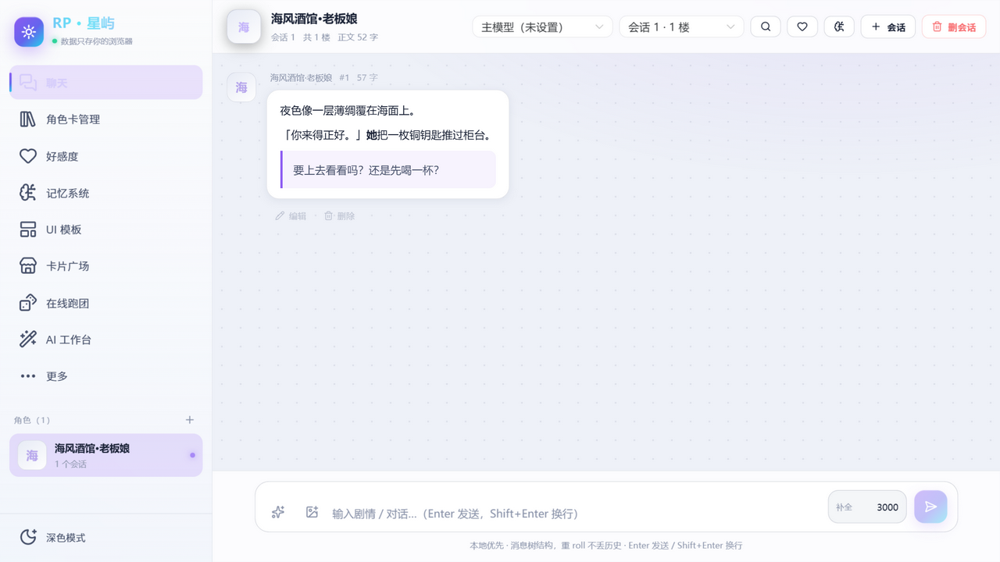
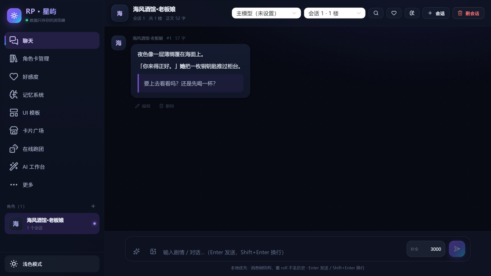
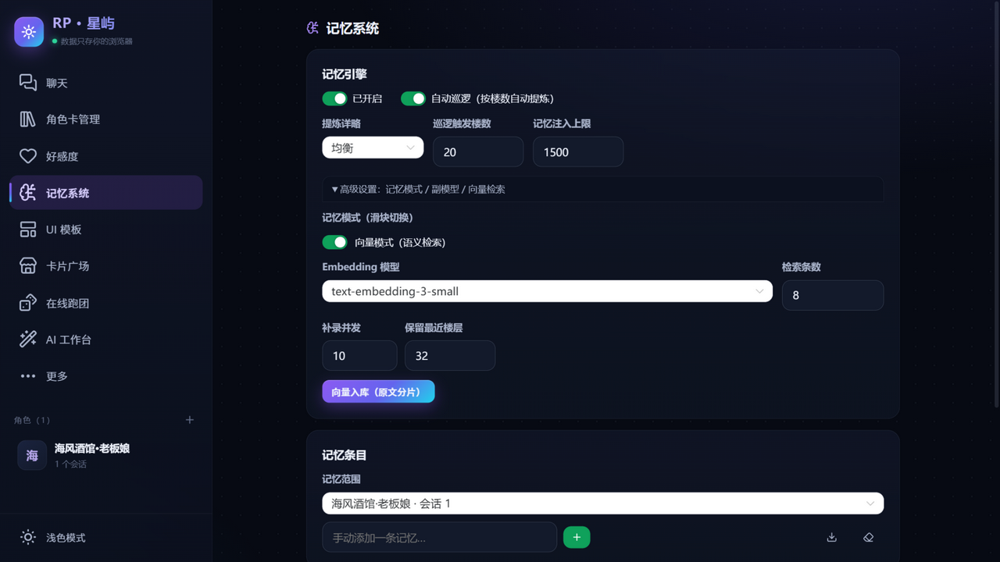
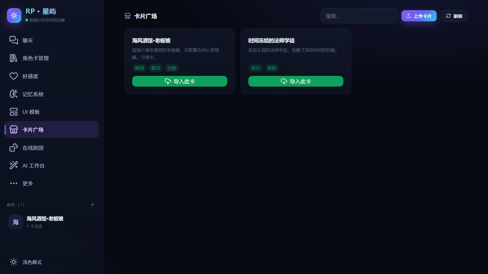
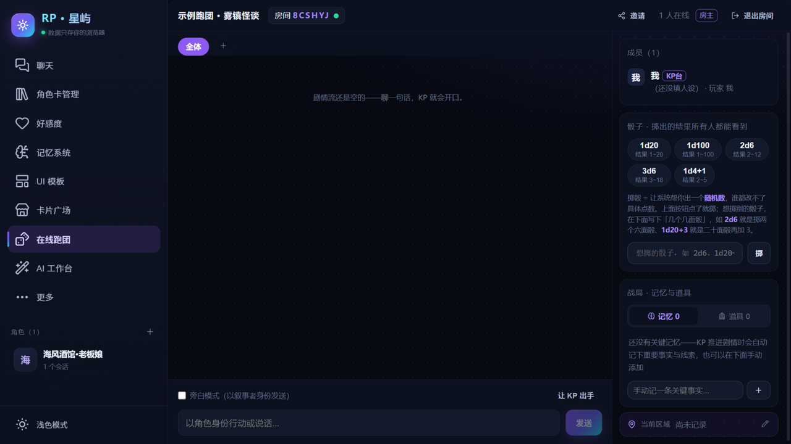
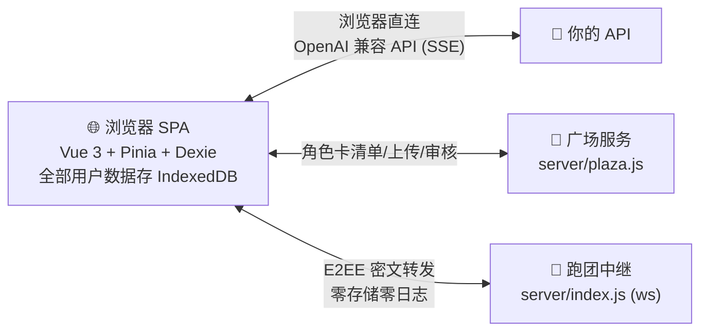

**中文** | [English](./README.en.md)

# RP · 星屿

<p align="center">
  
</p>

[](https://github.com/dfzjb/rp-xingyu/actions/workflows/ci.yml)
[](./LICENSE)


**本地优先的 AI 角色扮演 Web 应用**：所有数据只存在你的浏览器里——服务器零用户数据、无账号、无遥测。兼容 SillyTavern 角色卡生态，内置记忆系统、世界书、正则脚本、好感度引擎、交互式 UI 模板、卡片广场与端到端加密的多人在线跑团。

- 💾 **本地优先**：角色卡、聊天记录、API Key 全部存于浏览器 IndexedDB，清空浏览器 = 数据清空，随时一键备份/恢复
- 🔌 **模型自由**：浏览器直连任何 OpenAI 兼容 API（官方/中转/本地均可），主对话、记忆副模型、图片与视频生成模型独立配置
- 🌐 **纯静态**：构建产物可部署到任意静态托管的任意子路径，甚至双击 `dist/index.html` 直接使用

**在线体验**：[rp.dfzjb.site/new](https://rp.dfzjb.site/new/) （站主实例，自带 API Key 即可直接使用）

## ✨ 功能一览

### 💬 对话
- SSE 流式回复，思维链（CoT）自动折叠，正文与推理分离渲染
- **消息树**：重 roll 生成兄弟分支而非覆盖，分支自由切换，历史永不丢失
- 消息编辑/删除/续写/代入（以角色身份发送）、临时规范指令、图片附件
- 三模型槽位（主/备 A/备 B）顶栏快捷切换；温度、推理强度、上下文滑窗实时可调
- 楼层/字数统计、聊天记录全文搜索定位、聊天背景（角色封面 + 浓度/模糊）
- AI 输出与迁移的 HTML 消息经 DOMPurify 消毒后在沙箱 iframe 安全渲染
- 「messages 预览」调试面板：逐条查看最终发给模型的 messages 及其来源标签（预设/世界书/前奏/楼层/注入指令），排查"模型为什么这么想"

### 🗂 角色卡
- SillyTavern v2/v3 PNG（tEXt chunk）/JSON 导入导出，与酒馆生态互通
- 备选开场白、示例对话、system_prompt / post_history_instructions 覆盖、变量回写规则

### 🧠 记忆系统（总结 / 向量双引擎，滑块切换）
- **总结模式**：副模型分块提炼记忆条目，全量注入上下文
- **向量模式**：走 `/v1/embeddings` 语义检索，余弦相似度 Top-K 按轮注入
- 每轮自动入库 + 20 楼自动巡逻提炼 + 历史并发补录 + 保留最近 N 楼原文

### 🌍 世界书 & 正则
- 世界书可视化编辑器：ST 语义兼容（AND/OR/NOT 过滤、概率触发、扫描深度、递归激活、@深度注入、七种插入位置）
- 正则脚本：显示层 + 发送层双作用域，可视化启停排序，`(?i)(?s)(?m)` 内联修饰符、深度定向、代码块/HTML 保护

### 💗 好感度 Behavior Engine
- 六维三轴关系模型（兴趣↔厌烦、吸引↔反感、信任↔尴尬，0-100，对轴此消彼长）
- 9 段关系阶段（挚爱→敌对）+ 冲突联动；AI 每轮自主评判并与旧值平滑合并防跳变
- 纯 SVG 雷达图可视化；关系状态自动注入提示词约束角色言行；支持多 NPC 按"会话+角色名"建档

### 🎛 UI 模板引擎
- 角色卡可自带交互式 HTML 面板（手机 UI / 状态栏 / 仪表盘），`{{变量}}` / `{{#each}}` 模板语法，沙箱 iframe 渲染
- AI 回复实时驱动面板变量更新；整页 HTML 面板可交由副模型每轮重绘，主模型保持纯扮演

### 🛠 AI 工作台
- 一段自然语言让 AI 生成角色卡 / 世界书条目 / 正则脚本 / UI 模板，可编辑后入库

### 📜 预设
- 内置 15 条实战预设（破限、防抢话、防神化、防重复、文风、时间戳、人称视角……），强制存在、可启停、一键重置
- 自建带角色的有序条目；预设面板内置条目防误删

### 🛒 卡片广场
- 浏览远程卡池一键导入；开放上传（先审后上架）；站主凭管理口令解锁审核后台
- 自建广场服务零依赖（node:http），详见 [docs/plaza-server.md](./docs/plaza-server.md)

### 🎲 在线跑团
- 多人房间 + AI 担任 KP，玩家各饰一角；表达式骰子（1d20、2d6+3…）全员可见
- 规则系统：自由团 / COC7th / DND5e / 自定义；简洁/详细两种开团模式（KP 风格、模组梗概、内容红线等）
- 端到端加密：房间消息在浏览器内用房间码派生密钥加密，中继只见密文、**零存储零日志**；战役只存房主浏览器，可一键恢复重开

### 🔄 数据管理
- `legacy_backup_*.json` 全库备份导入导出（与旧版同构互导）；酒馆 JSONL 聊天记录导入；用量统计

## 🖼 界面预览

| 深色模式 | 记忆系统 |
|---|---|
|  |  |
| **卡片广场** | **在线跑团** |
|  |  |

## 🏗 架构



服务器**永远不接触**你的对话内容与 API Key：跑团消息端到端加密，广场只托管角色卡文件与待审队列。纯静态部署时只跑前端，两个服务组件按需自建。

## 🚀 快速开始

```bash
git clone https://github.com/dfzjb/rp-xingyu.git
cd rp-xingyu
npm install
npm run dev        # http://127.0.0.1:5273
```

打开「更多 → 语言模型」填入你的 API Base URL 与 Key（仅存本机浏览器），「获取模型列表」选择模型后即可开始对话。

## 📦 部署

- **任意静态托管**：`npm run build` → `dist/`（`base: './'`，支持任意子路径，也可双击 index.html 离线使用）
- **GitHub Pages**：仓库已内置 [`.github/workflows/deploy.yml`](.github/workflows/deploy.yml)——推送到 main 自动构建发布；仓库 Settings → Pages → Source 选 **GitHub Actions** 即可
- **自建服务组件**（可选）：在线跑团中继 `npm run server`（唯一依赖 ws，端口 8787）、广场服务 `npm run plaza`（零依赖，端口 8788）；生产环境建议 systemd + nginx 反代，参见 [docs/plaza-server.md](./docs/plaza-server.md) 与 `deploy/`

## 🔄 从 旧版 旧版迁移

旧版用户可在「导入 / 导出」页选择 `legacy_backup_*.json` 一键恢复全部角色卡与聊天记录；新站导出的备份同样可被旧版导入，双向互通。

## 🧪 测试

```bash
npm test           # Vitest，304 项单元测试（引擎层 / db 持久化 / 跑团 / 广场服务 / 旧版迁移）
npm run typecheck  # vue-tsc 类型检查
```

## 📄 许可证

本项目以 [CC BY-NC 4.0](./LICENSE)（署名-非商业性使用 4.0 国际）协议发布。内置预设文本沿用旧版 旧版（CC BY-NC 4.0 © ）的文本资源。

## 🙏 致谢

- [SillyTavern](https://github.com/SillyTavern/SillyTavern) —— 角色卡生态与设计思路参考
- Artemis —— 设计思路借鉴
- 旧版 旧版（© ）—— 内置预设文本来源与本项目的直接前身

## ⚠️ 免责声明

本项目是虚构创作工具，角色扮演内容由 AI 模型生成，不代表开发者立场。请在遵守你所在地区法律法规及模型服务商使用条款的前提下使用；对配置的模型、提示词与生成内容自行负责。
